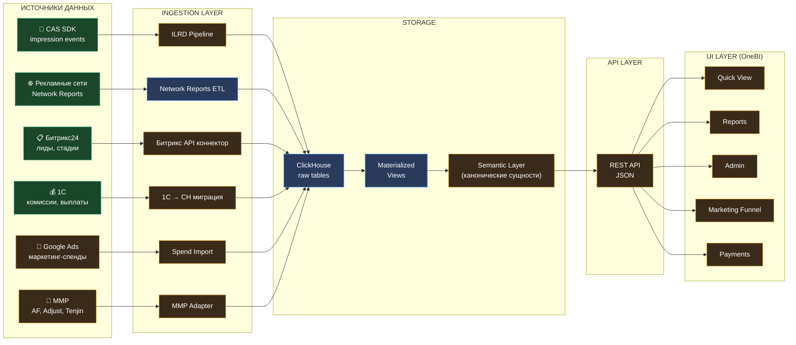
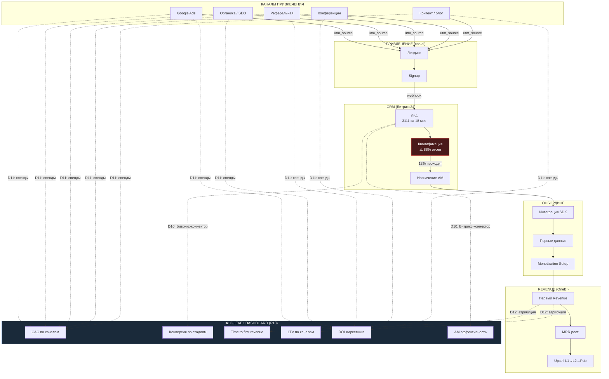
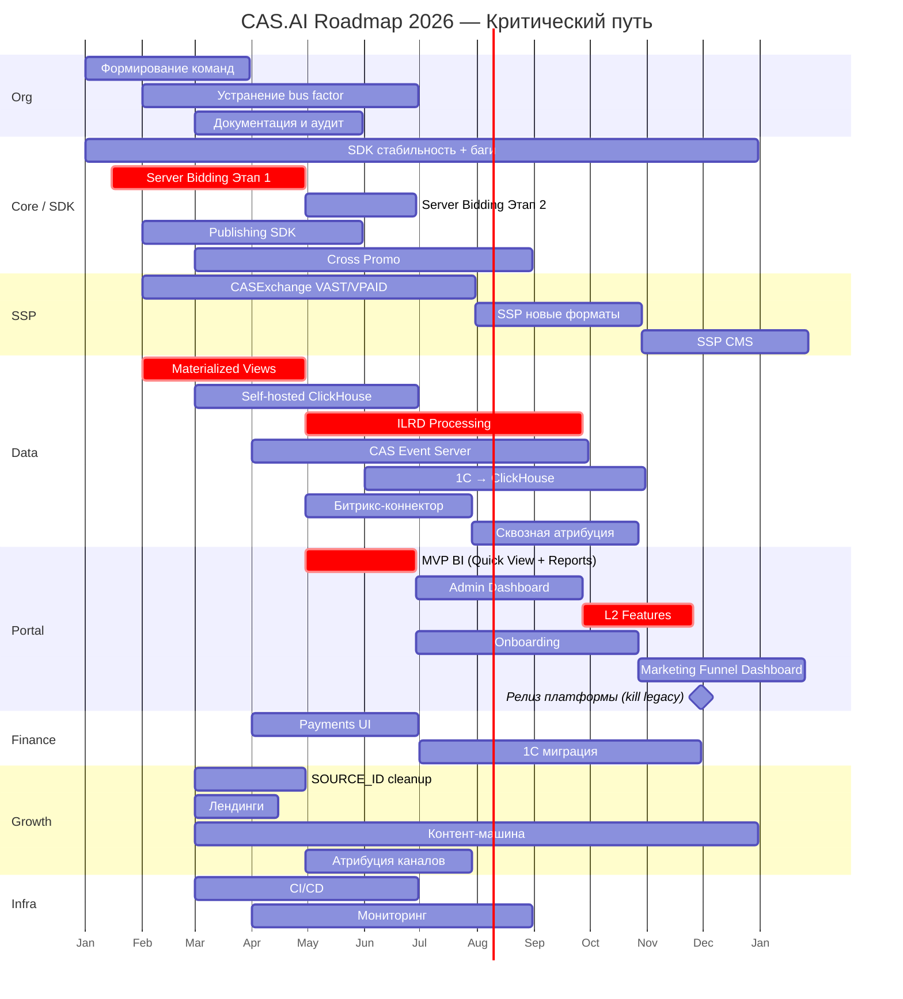

# CAS.AI — Карта компонентов

> **Версия:** 1.0
> **Дата:** 2026-02-24
> **Источник:** roadmap v3.0, план CTO, Trello SDK, OneBI прототип

---

## 1. Общая архитектура платформы

```mermaid
graph TB
    subgraph CLIENTS["👤 КЛИЕНТЫ"]
        L1["L1 — базовый<br/>~$5K/мес"]
        L2["L2 — продвинутый<br/>~$12.5K/мес"]
        PubC["PubC — кандидат<br/>в паблишинг"]
        Pub["Pub — паблишер<br/>$50K+/мес"]
    end

    subgraph INTERNAL["👔 ВНУТРЕННИЕ РОЛИ"]
        Admin["Admin"]
        AM["Account Manager"]
        BD["BizDev"]
        RND["RnD"]
        UA["UA"]
        CEO["C-level"]
    end

    subgraph PLATFORM["🏰 ЦАРЬ-ПЛАТФОРМА (OneBI)"]
        QV["Quick View<br/>KPI-карточки"]
        REP["Reports<br/>BI-аналитика"]
        ADMIN_DASH["Admin Dashboard<br/>портфель, аномалии"]
        AM_PERF["AM Performance<br/>эффективность менеджеров"]
        PUB_DASH["Pub Dashboard<br/>profit, ROAS, health"]
        PAY["Payments<br/>баланс, выплаты"]
        FUNNEL["Marketing Funnel<br/>каналы → лиды → MRR"]
        ONBOARD["Onboarding<br/>welcome, SDK setup"]
        INV["Инвентарь<br/>рекламные слоты"]
        HEALTH["Product Health<br/>история приложения"]
    end

    subgraph DATA["📊 DATA PLATFORM"]
        CH["ClickHouse<br/>self-hosted"]
        MV["Materialized<br/>Views"]
        ILRD["ILRD<br/>Processing"]
        SEM["Semantic<br/>Layer"]
        EVT["CAS Event<br/>Server"]
        MMP_CON["MMP-коннекторы<br/>AF, Adjust, Tenjin"]
        BX_CON["Битрикс-<br/>коннектор"]
        SPEND_CON["Маркетинг-<br/>спенды"]
        ATTR["Сквозная<br/>атрибуция"]
    end

    subgraph SDK_CLUSTER["📱 SDK PRODUCTS"]
        SDK["CAS SDK v4<br/>медиация"]
        PUB_SDK["Publishing<br/>SDK"]
        SB["Server<br/>Bidding"]
    end

    subgraph SSP_CLUSTER["🔄 CAS SSP"]
        EX["CAS Exchange"]
        SSP_CMS["SSP CMS"]
        SSP_AN["SSP Analytics"]
    end

    subgraph FINANCE_SYS["💰 FINANCE"]
        F_1C["1С<br/>(legacy)"]
        F_BILL["Биллинг"]
        F_REF["Реферальная<br/>программа"]
    end

    subgraph CRM_SYS["📋 CRM"]
        BX["Битрикс24"]
        HS["HubSpot"]
    end

    subgraph MARKETING["📣 MARKETING"]
        SITE["cas.ai<br/>8 языков"]
        BLOG["Блог +<br/>контент"]
        MC["MailChimp"]
    end

    subgraph NETWORKS["🌐 РЕКЛАМНЫЕ СЕТИ"]
        ADMOB["AdMob"]
        AL["AppLovin"]
        UNITY["Unity Ads"]
        IS["ironSource"]
        META["Meta AN"]
        OTHER_NET["Pangle, Bigo,<br/>Liftoff..."]
    end

    %% Client flows
    L1 & L2 --> QV & REP
    Pub --> PUB_DASH & QV & REP
    PubC --> ONBOARD
    CEO --> FUNNEL & ADMIN_DASH
    Admin --> ADMIN_DASH
    AM --> AM_PERF
    BD --> FUNNEL

    %% Platform → Data
    QV & REP --> MV
    ADMIN_DASH --> MV
    PUB_DASH --> ILRD & MMP_CON
    FUNNEL --> BX_CON & SPEND_CON & ATTR
    AM_PERF --> BX_CON
    HEALTH --> ILRD & EVT
    PAY --> F_BILL

    %% Data internals
    MV --> CH
    ILRD --> CH
    EVT --> CH
    SEM --> CH
    MMP_CON --> SEM
    BX_CON --> CH
    SPEND_CON --> CH
    ATTR --> BX_CON & MV

    %% SDK → Data
    SDK -->|"ILRD данные"| CH
    SDK -->|"events"| EVT
    PUB_SDK -->|"auto ILRD"| CH
    SB -->|"auction logs"| CH

    %% SDK → Networks
    SDK --- ADMOB & AL & UNITY & IS & META & OTHER_NET
    SB -->|"s2s bidding"| ADMOB & AL & OTHER_NET

    %% SSP
    EX --- SDK
    EX --> SSP_CMS
    SSP_CMS --> SSP_AN
    SSP_AN --> CH

    %% Finance
    F_1C -->|"миграция"| CH
    F_BILL --> F_1C
    F_REF --> F_1C

    %% CRM → Data
    BX -->|"API"| BX_CON
    HS -.->|"подмножество"| BX

    %% Marketing
    SITE -->|"signup"| BX
    SITE --> MC
    BLOG --> SITE

    classDef done fill:#1a472a,stroke:#42b983,color:#fff
    classDef wip fill:#2a3a5c,stroke:#58A6FF,color:#fff
    classDef planned fill:#3a2a1a,stroke:#d29922,color:#fff
    classDef legacy fill:#4a1a1a,stroke:#f85149,color:#fff

    class SDK,EX,BX,HS,SITE,F_1C,F_BILL done
    class MV,SB,PUB_SDK,QV,REP wip
    class ILRD,SEM,EVT,MMP_CON,BX_CON,SPEND_CON,ATTR,ADMIN_DASH,AM_PERF,PUB_DASH,FUNNEL,PAY,ONBOARD,INV,HEALTH,SSP_CMS,SSP_AN,F_REF,BLOG,MC planned
    class F_1C legacy
```

**Легенда:** 🟢 Продакшен — 🔵 В работе — 🟡 Планируется — 🔴 Legacy (миграция)

---

## 2. Поток данных

---

## 3. Маркетинговая воронка — сквозной поток

---

## 4. SDK-экосистема и рекламные сети

```mermaid
flowchart TB
    subgraph APP["📱 МОБИЛЬНОЕ ПРИЛОЖЕНИЕ"]
        CAS_SDK["CAS SDK v4"]
        PUB_SDK_INT["Publishing SDK"]
    end

    subgraph AUCTION["АУКЦИОН"]
        WF["Waterfall<br/>(клиентский)"]
        SB_AUC["Server Bidding<br/>(серверный)"]
    end

    subgraph EXCHANGE_BLOCK["CAS SSP"]
        CAS_EX["CAS Exchange"]
        VAST["VAST 3.0/4.0+"]
        VPAID_F["VPAID"]
        NATIVE["Native Ads"]
        APPOPEN["AppOpen"]
    end

    subgraph NETWORKS_DETAIL["РЕКЛАМНЫЕ СЕТИ"]
        direction TB
        subgraph SB_READY["Server Bidding ✅"]
            N_CHART["Chartboost"]
        end
        subgraph SB_PLANNED["Server Bidding 🔵 Этап 1"]
            N_LIFT["Liftoff"]
            N_INMOBI["inMobi"]
            N_MINT["Mintegral"]
            N_PANGLE["Pangle"]
            N_YANDEX["Yandex"]
            N_YSO["YSO"]
            N_MATICOO["Maticoo"]
        end
        subgraph WF_ONLY["Waterfall Only"]
            N_ADMOB["AdMob"]
            N_APPLOVIN["AppLovin"]
            N_UNITY["Unity Ads"]
            N_IS["ironSource"]
            N_META["Meta AN"]
            N_BIGO["Bigo Ads"]
            N_AMAZON["Amazon ❌"]
            N_MOLOKO["Молоко ❌"]
        end
    end

    subgraph DATA_OUT["📊 ДАННЫЕ"]
        ILRD_OUT["ILRD → ClickHouse"]
        EVT_OUT["Events → Event Server"]
        NR_OUT["Network Reports"]
    end

    CAS_SDK --> WF --> N_ADMOB & N_APPLOVIN & N_UNITY & N_IS & N_META & N_BIGO
    CAS_SDK --> SB_AUC --> N_CHART & N_LIFT & N_INMOBI & N_MINT & N_PANGLE & N_YANDEX & N_YSO & N_MATICOO
    CAS_SDK --> CAS_EX
    CAS_EX --> VAST & VPAID_F & NATIVE & APPOPEN

    PUB_SDK_INT --> CAS_SDK

    CAS_SDK -->|"impression-level"| ILRD_OUT
    CAS_SDK -->|"session, IAP"| EVT_OUT
    N_ADMOB & N_APPLOVIN & N_UNITY & N_IS & N_META -->|"daily reports"| NR_OUT

    classDef done fill:#1a472a,stroke:#42b983,color:#fff
    classDef wip fill:#2a3a5c,stroke:#58A6FF,color:#fff
    classDef planned fill:#3a2a1a,stroke:#d29922,color:#fff
    classDef blocked fill:#4a1a1a,stroke:#f85149,color:#fff

    class CAS_SDK,CAS_EX,N_ADMOB,N_APPLOVIN,N_UNITY,N_IS,N_META,N_BIGO,N_CHART done
    class SB_AUC,PUB_SDK_INT,VAST wip
    class VPAID_F,NATIVE,APPOPEN,N_LIFT,N_INMOBI,N_MINT,N_PANGLE,N_YANDEX,N_YSO,N_MATICOO planned
    class N_AMAZON,N_MOLOKO blocked
```

---

## 5. Царь-платформа — views по ролям

```mermaid
flowchart TB
    subgraph PLATFORM_VIEWS["🏰 ОБЪЕДИНЁННАЯ ПЛАТФОРМА"]
        subgraph B2B["B2B VIEWS"]
            V_QV["Quick View<br/>🔵 MVP"]
            V_REP["Reports<br/>🔵 MVP"]
            V_PAY["Payments<br/>🟡 F1"]
            V_L2["L2 Features<br/>🟡 P2"]
            V_PUB["Pub Dashboard<br/>🟡 P5"]
            V_PUBC["PubC Portal<br/>🟡 P4"]
            V_ONBOARD["Onboarding<br/>🟡 P3"]
        end

        subgraph INT["INTERNAL VIEWS"]
            V_ADMIN["Admin Dashboard<br/>🟡 P6"]
            V_AM["AM Performance<br/>🟡 P14"]
            V_FUNNEL["Marketing Funnel<br/>🟡 P13"]
            V_HEALTH["Product Health<br/>🟡 P11"]
            V_INV["Инвентарь<br/>🟡 P10"]
        end

        subgraph SSP_V["SSP VIEWS"]
            V_SSP_CMS["SSP CMS<br/>🟡 SSP-3"]
            V_SSP_AN["SSP Analytics<br/>🟡 SSP-4"]
        end
    end

    R_L1["L1"] --> V_QV & V_REP & V_PAY
    R_L2["L2"] --> V_QV & V_REP & V_PAY & V_L2
    R_PUB["Pub"] --> V_QV & V_REP & V_PAY & V_PUB
    R_PUBC["PubC"] --> V_ONBOARD & V_PUBC & V_QV
    R_CEO["CEO"] --> V_ADMIN & V_FUNNEL & V_AM
    R_ADMIN["Admin"] --> V_ADMIN & V_HEALTH & V_REP
    R_AM["AM"] --> V_AM & V_HEALTH & V_REP
    R_BD["BD"] --> V_FUNNEL & V_ADMIN
    R_RND["RnD"] --> V_REP & V_HEALTH
    R_SSP_MGR["SSP Manager"] --> V_SSP_CMS & V_SSP_AN

    classDef wip fill:#2a3a5c,stroke:#58A6FF,color:#fff
    classDef planned fill:#3a2a1a,stroke:#d29922,color:#fff

    class V_QV,V_REP wip
    class V_PAY,V_L2,V_PUB,V_PUBC,V_ONBOARD,V_ADMIN,V_AM,V_FUNNEL,V_HEALTH,V_INV,V_SSP_CMS,V_SSP_AN planned
```

---

## 6. Критический путь — timeline

---

## 7. Команды и зоны ответственности

```mermaid
flowchart LR
    subgraph CTO_ZONE["Вова (CTO)"]
        T_INFRA["Infrastructure<br/>Team"]
        T_CORE_BE["Core<br/>Back-end"]
        T_CMS["CMS<br/>Development"]
    end

    subgraph SDK_ZONE["Денис (SDK Lead)"]
        T_CLIENT["Client Side<br/>Team"]
        SDK_P["CAS SDK"]
        SB_P["Server Bidding"]
        EX_P["CAS Exchange / SSP"]
    end

    subgraph DATA_ZONE["Борис (Data Lead)"]
        T_DATA["Data Engineering<br/>Team"]
        CH_P["ClickHouse"]
        ILRD_P["ILRD"]
        EVT_P["Event Server"]
    end

    subgraph FRONT_ZONE["Руслан (Frontend Lead)"]
        ONEBI_P["OneBI<br/>царь-платформа"]
    end

    subgraph PRODUCT_ZONE["Алексей (PO)"]
        SPEC["Спецификации"]
        UX["UX / прототип"]
        QA_P["QA"]
    end

    subgraph MARKETING_ZONE["Никита (Marketing)"]
        SITE_P["cas.ai"]
        CONTENT_P["Контент"]
    end

    subgraph FINANCE_ZONE["Толик (1С)"]
        F1C_P["1С система"]
        REF_P["Реферальная"]
    end

    T_INFRA -.->|"CI/CD, мониторинг"| SDK_P & ONEBI_P & CH_P
    T_CORE_BE -.->|"API"| ONEBI_P
    T_CMS -.->|"CMS"| EX_P

    T_CLIENT --> SDK_P & SB_P & EX_P
    T_DATA --> CH_P & ILRD_P & EVT_P

    CH_P -->|"данные"| ONEBI_P
    SPEC -->|"ТЗ"| ONEBI_P & SDK_P

    style CTO_ZONE fill:#1a2a3a,stroke:#58A6FF
    style SDK_ZONE fill:#1a3a2a,stroke:#42b983
    style DATA_ZONE fill:#3a2a1a,stroke:#d29922
    style FRONT_ZONE fill:#2a1a3a,stroke:#a371f7
    style PRODUCT_ZONE fill:#3a1a2a,stroke:#f778ba
    style MARKETING_ZONE fill:#1a3a3a,stroke:#39d2c0
    style FINANCE_ZONE fill:#4a1a1a,stroke:#f85149
```

---

## Статусы компонентов — сводка

| Компонент | Статус | Владелец | Bus Factor |
|-----------|--------|----------|-----------|
| CAS SDK v4 | 🟢 Продакшен | Денис | ⚠️ 1 чел |
| CAS Exchange | 🟢 Продакшен | Денис | ⚠️ 1 чел |
| Server Bidding | 🔵 В работе | Денис | ⚠️ 1 чел |
| Publishing SDK | 🔵 В работе | Юра | ⚠️ 1 чел |
| B2B кабинет (legacy) | 🔴 Legacy | Вова/Руслан | — |
| OneBI (прототип) | 🔵 Прототип | Алексей | — |
| OneBI (продакшен) | 🟡 MVP в работе | Руслан | ⚠️ 1 чел |
| ClickHouse (облако) | 🟢 Продакшен | Борис | ⚠️ 1 чел |
| Materialized Views | 🔵 В работе | Борис | ⚠️ 1 чел |
| ILRD Processing | 🟡 Планируется | Борис | ⚠️ 1 чел |
| Битрикс-коннектор | 🟡 Планируется | — | — |
| 1С | 🔴 Legacy | Толик | ⚠️ 1 чел |
| cas.ai (сайт) | 🟢 Продакшен | Женя (~1 нед/мес) | ⚠️ |
| Битрикс24 | 🟢 Продакшен | AM-команда | ✅ |
| Superset (внутр.) | 🟢 Продакшен | Борис | ⚠️ 1 чел |

**⚠️ Bus factor критичен:** 6 из 15 компонентов держатся на одном человеке.
