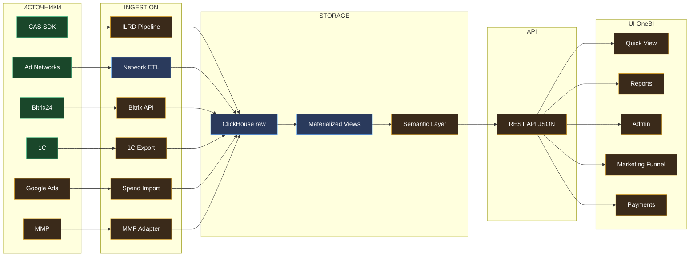
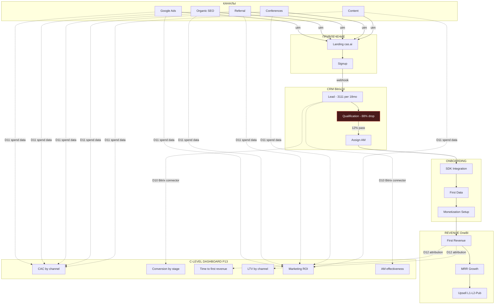
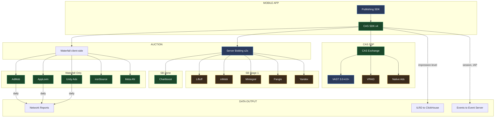
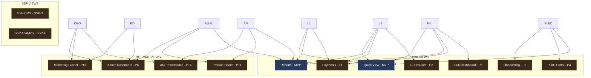
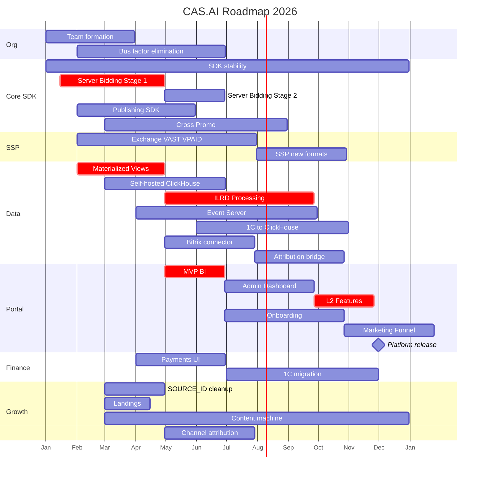

# CAS.AI — Карта компонентов

> **Версия:** 1.1
> **Дата:** 2026-02-24
> **Источник:** roadmap v3.0, план CTO, Trello SDK, OneBI прототип

---

## 1. Общая архитектура платформы

```mermaid
graph TB
    subgraph CLIENTS["КЛИЕНТЫ"]
        L1["L1 базовый"]
        L2["L2 продвинутый"]
        PubC["PubC кандидат"]
        Pub["Pub паблишер"]
    end

    subgraph INTERNAL["ВНУТРЕННИЕ РОЛИ"]
        Admin["Admin"]
        AM["Account Manager"]
        BD["BizDev"]
        CLev["C-level"]
    end

    subgraph PLATFORM["ЦАРЬ-ПЛАТФОРМА OneBI"]
        QV["Quick View"]
        REP["Reports"]
        ADMIND["Admin Dashboard"]
        AMPERF["AM Performance"]
        PUBD["Pub Dashboard"]
        PAY["Payments"]
        FUNNEL["Marketing Funnel"]
        ONBOARD["Onboarding"]
        HEALTH["Product Health"]
    end

    subgraph DATA["DATA PLATFORM"]
        CH["ClickHouse"]
        MV["Materialized Views"]
        ILRD["ILRD Processing"]
        SEM["Semantic Layer"]
        EVT["Event Server"]
        BXCON["Bitrix Connector"]
    end

    subgraph SDKC["SDK PRODUCTS"]
        SDK["CAS SDK v4"]
        PUBSDK["Publishing SDK"]
        SB["Server Bidding"]
    end

    subgraph SSPC["CAS SSP"]
        EX["CAS Exchange"]
        SSPCMS["SSP CMS"]
    end

    subgraph FINSYS["FINANCE"]
        F1C["1C legacy"]
        BILL["Billing"]
    end

    subgraph CRMSYS["CRM"]
        BX["Bitrix24"]
        HS["HubSpot"]
    end

    subgraph MKT["MARKETING"]
        SITE["cas.ai"]
    end

    subgraph NETS["AD NETWORKS"]
        ADMOB["AdMob"]
        APPL["AppLovin"]
        UADS["Unity Ads"]
        IRON["ironSource"]
        METAN["Meta AN"]
    end

    L1 & L2 --> QV & REP
    Pub --> PUBD
    PubC --> ONBOARD
    CLev --> FUNNEL & ADMIND
    Admin --> ADMIND
    AM --> AMPERF
    BD --> FUNNEL

    QV & REP --> MV
    ADMIND --> MV
    PUBD --> ILRD
    FUNNEL --> BXCON
    AMPERF --> BXCON
    HEALTH --> ILRD & EVT
    PAY --> BILL

    MV --> CH
    ILRD --> CH
    EVT --> CH
    SEM --> CH
    BXCON --> CH

    SDK -->|ILRD| CH
    SDK -->|events| EVT
    PUBSDK --> SDK
    SB -->|auction logs| CH

    SDK --- ADMOB & APPL & UADS & IRON & METAN
    SB --> ADMOB & APPL

    EX --- SDK
    SSPCMS --> EX

    F1C -->|migration| CH
    BILL --> F1C

    BX -->|API| BXCON
    HS -.-> BX
    SITE -->|signup| BX

    classDef done fill:#1a472a,stroke:#42b983,color:#fff
    classDef wip fill:#2a3a5c,stroke:#58A6FF,color:#fff
    classDef planned fill:#3a2a1a,stroke:#d29922,color:#fff
    classDef legacy fill:#4a1a1a,stroke:#f85149,color:#fff

    class SDK,EX,BX,HS,SITE,BILL,ADMOB,APPL,UADS,IRON,METAN done
    class MV,SB,PUBSDK,QV,REP wip
    class ILRD,SEM,EVT,BXCON,ADMIND,AMPERF,PUBD,FUNNEL,PAY,ONBOARD,HEALTH,SSPCMS planned
    class F1C legacy
```

Легенда: зеленый = продакшен, синий = в работе, оранжевый = планируется, красный = legacy

---

## 2. Поток данных

---

## 3. Маркетинговая воронка

---

## 4. SDK и рекламные сети

---

## 5. Платформа — views по ролям

---

## 6. Критический путь — timeline

---

## 7. Команды и зоны

```mermaid
flowchart LR
    subgraph CTO["Vova CTO"]
        TINF["Infrastructure"]
        TBE["Core Backend"]
        TCMS["CMS Dev"]
    end

    subgraph SDKL["Denis SDK Lead"]
        TCLI["Client Side"]
        TSDK["CAS SDK"]
        TSB["Server Bidding"]
        TEX["CAS Exchange"]
    end

    subgraph DATAL["Boris Data Lead"]
        TDE["Data Engineering"]
        TCH["ClickHouse"]
        TILRD["ILRD"]
        TEVT["Event Server"]
    end

    subgraph FRONT["Ruslan Frontend"]
        TOBI["OneBI Platform"]
    end

    subgraph PROD["Alexei PO"]
        TSPEC["Specs"]
        TUX["UX Prototype"]
        TQA["QA"]
    end

    subgraph MKTL["Nikita Marketing"]
        TSITE["cas.ai"]
        TCONT["Content"]
    end

    subgraph FINL["Tolik Finance"]
        T1C["1C System"]
        TREF["Referral"]
    end

    TINF -.->|CI/CD| TSDK & TOBI & TCH
    TBE -.->|API| TOBI
    TCLI --> TSDK & TSB & TEX
    TDE --> TCH & TILRD & TEVT
    TCH -->|data| TOBI
    TSPEC -->|specs| TOBI & TSDK

    style CTO fill:#1a2a3a,stroke:#58A6FF
    style SDKL fill:#1a3a2a,stroke:#42b983
    style DATAL fill:#3a2a1a,stroke:#d29922
    style FRONT fill:#2a1a3a,stroke:#a371f7
    style PROD fill:#3a1a2a,stroke:#f778ba
    style MKTL fill:#1a3a3a,stroke:#39d2c0
    style FINL fill:#4a1a1a,stroke:#f85149
```

---

## Статусы компонентов — сводка

| Компонент | Статус | Владелец | Bus Factor |
|-----------|--------|----------|-----------|
| CAS SDK v4 | prod | Денис | 1 чел |
| CAS Exchange | prod | Денис | 1 чел |
| Server Bidding | WIP | Денис | 1 чел |
| Publishing SDK | WIP | Юра | 1 чел |
| B2B кабинет legacy | legacy | Вова/Руслан | - |
| OneBI прототип | WIP | Алексей | - |
| OneBI продакшен | planned | Руслан | 1 чел |
| ClickHouse | prod | Борис | 1 чел |
| Materialized Views | WIP | Борис | 1 чел |
| ILRD Processing | planned | Борис | 1 чел |
| Bitrix connector | planned | - | - |
| 1C | legacy | Толик | 1 чел |
| cas.ai сайт | prod | Женя 1нед/мес | partial |
| Bitrix24 | prod | AM team | ok |
| Superset | prod internal | Борис | 1 чел |

Bus factor критичен: 6 из 15 компонентов на одном человеке.
